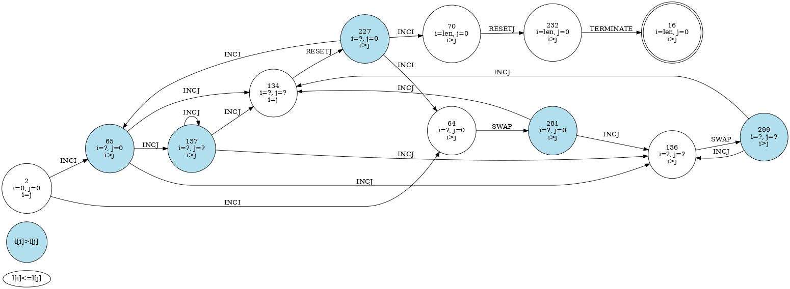
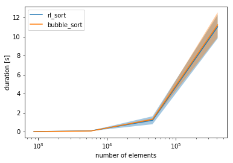

# RLOpt
In this project, a *human-readable solution of an arbitrary optimization problem through Reinforcement Learning* is presented.

Instead of manually designing an optimal algorithm for each individual problem with this framework a generalistic approach is provided:
It does not only gives its best by means of correctness but also by time-efficiency!

Although problem-specific customization of the environment is needed, it is yet easy to obtain one.
For illustration purpose, you'll find in this framework an exemplary environment suitable for maximizing a reward based on rearranging any given 1D list.

Note, that not only the action space is independent of the state space, moreover the state space in its behalf is also independent of the concrete list.
This ensures scalability towards larger optimization problems and raises the opportunity of a generalized solution.

## Objective
To proof functionality, I decided to investigate *»sorting«* as a popular 1D optimization problem
although other ideas with a deterministic behavior like
- arranging a gallery where between each slides a best keywords match is obtained,
- optimizing which employee should be in which office to avoid e.g. long paths and free spaces,
- optimizing any kind of schedule i.e. in classes or
- finding a great solution to the traveling salesman problem e.g. in delivery, travel or production-chain
  related issues

could be calculated.

The sorting problem does have in contrast to other applications a strong constraint towards correctness which enables the opportunity of investigating its generalization capabilities, too.

## Algorithmic

1. **Learn** the task through training a Q-table with the Bellman equation.
2. **Collect** all used states for solving the task in a transition table.
3. **Reconstruct** the learned algorithm either through
    - a *final-state-machine (fsm) graph (automatically)*,
    - a *lambda function based on the transition table (automatically)* or
    - a *simplified fsm and code version (manually)* for algorithm speedup.

Example code could be obtained [here (sorting)](rlopt/rl_sorting.py).

## Results
### RLSort
The resulting algorithm after *~5M* episodes in [transitions.csv](transitions.csv) and below:



#### Transition table (simplified)
Initial values: *j = 0* and *i = 1*.

| l[i] vs l[j] | i vs j | i | j | last action | to-be-executed action |
|:------------:|:------:|:-:|:-:|:-----------:|:---------------------:|
|      ?       |   ?    | 1 | ? |      ?      |       TERMINATE       |
|      ?       |   0    | 0 | ? |      ?      |     RESETJ + INCI     |
|      0       |   1    | 0 | ? |      ?      |      SWAP + INCJ      |
|      1       |   ?    | ? | ? |      ?      |          INCJ         |

#### Pseudo code
```python
j <- 0
i <- 1
while action is not TERMINATE:
    if i == len(l):
        action <- TERMINATE
    elif l[i] > l[j]:
        action <- INCJ
    elif i > j:
        action <- SWAP
        action <- INCJ
    else:
        action <- RESETJ
        action <- INCI
```

#### Performance comparison: [RLSort.ipynb](RLSort.ipynb)

The algorithmic complexity of the non-simplified learned RLSort is w.r.t. the number of needed steps:
- *Min*: `O(0.5n² + 1.5n + 1)`
- *Max*: `O(n² + n + 1)`

On the simplified version however it's faster and (surprisingly) constant:
- *Min*: `O(0.5n² + 0.5n)`
- *Max*: `O(0.5n² + 0.5n)`



Note, that due to the restricted actions (imcrement by one, reset to zero) just algorithms of a n²-magnitude
could be learned.

#### Example call (of the original version)
```
  2 <<- [6 4 3 7 0], i=0, j=0: INCI.
 64 <<- [6 4 3 7 0], i=1, j=0: SWAP.
281 <<- [4 6 3 7 0], i=1, j=0: INCJ.
134 <<- [4 6 3 7 0], i=1, j=1: RESETJ.
227 <<- [4 6 3 7 0], i=1, j=0: INCI.
 64 <<- [4 6 3 7 0], i=2, j=0: SWAP.
281 <<- [3 6 4 7 0], i=2, j=0: INCJ.
136 <<- [3 6 4 7 0], i=2, j=1: SWAP.
299 <<- [3 4 6 7 0], i=2, j=1: INCJ.
134 <<- [3 4 6 7 0], i=2, j=2: RESETJ.
227 <<- [3 4 6 7 0], i=2, j=0: INCI.
 65 <<- [3 4 6 7 0], i=3, j=0: INCJ.
137 <<- [3 4 6 7 0], i=3, j=1: INCJ.
137 <<- [3 4 6 7 0], i=3, j=2: INCJ.
134 <<- [3 4 6 7 0], i=3, j=3: RESETJ.
227 <<- [3 4 6 7 0], i=3, j=0: INCI.
 64 <<- [3 4 6 7 0], i=4, j=0: SWAP.
281 <<- [0 4 6 7 3], i=4, j=0: INCJ.
136 <<- [0 4 6 7 3], i=4, j=1: SWAP.
299 <<- [0 3 6 7 4], i=4, j=1: INCJ.
136 <<- [0 3 6 7 4], i=4, j=2: SWAP.
299 <<- [0 3 4 7 6], i=4, j=2: INCJ.
136 <<- [0 3 4 7 6], i=4, j=3: SWAP.
299 <<- [0 3 4 6 7], i=4, j=3: INCJ.
134 <<- [0 3 4 6 7], i=4, j=4: RESETJ.
227 <<- [0 3 4 6 7], i=4, j=0: INCI.
 70 <<- [0 3 4 6 7], i=5, j=0: RESETJ.
232 <<- [0 3 4 6 7], i=5, j=0: TERMINATE.
Sorted list in 28 steps: [0 3 4 6 7]
```

